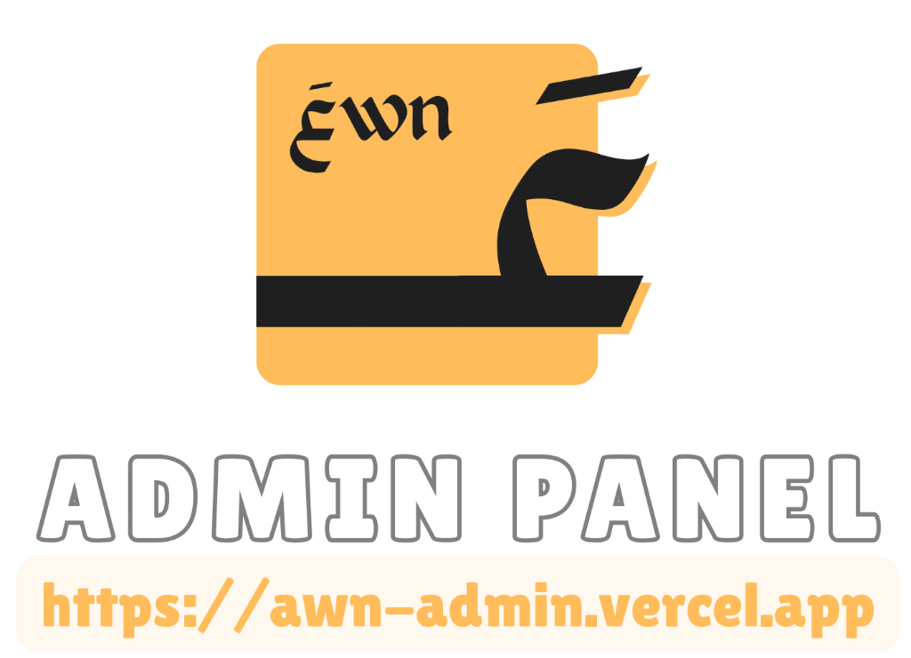

<div align="center">
  
  
  # AWN Admin Dashboard | لوحة تحكم عون
  
  ### *Advanced Intelligence & Governance for Volunteering Ecosystems*
  ### *استخبارات وحوكمة متقدمة لمنظومات التطوع*
  
  [](https://nextjs.org/)
  [](https://tailwindcss.com/)
  [](https://www.typescriptlang.org/)
  [](https://www.chartjs.org/)
</div>

---

## 🌟 Overview | نظرة عامة

**AWN Admin** is a premium, bilingual administrative powerhouse designed to manage and scale volunteering platforms. It combines high-end aesthetics with deep functional intelligence, ensuring operational transparency and financial accuracy.

**لوحة تحكم عون** هي محرك إداري متميز ثنائي اللغة، مصمم لإدارة وتوسيع منصات التطوع. تجمع اللوحة بين الجماليات العالية والذكاء الوظيفي العميق، مما يضمن الشفافية التشغيلية والدقة المالية.

---

## ✨ Key Features | المميزات الرئيسية

### 🌍 100% Bilingual & RTL Ready | منصة ثنائية اللغة بالكامل
*   **English & Arabic Support**: Seamless, real-time language switching across the entire dashboard.
*   **RTL Optimized**: Pixel-perfect layouts for Arabic Typography and right-to-left navigation.

### 📊 Financial Intelligence | الذكاء المالي
*   **Revenue Analytics**: Interactive line charts tracking commissions and subscription growth.
*   **Duration Filtering**: Analyze performance across the last 3, 6, or 12 months.
*   **Earnings Ledger**: Detailed audit of every EGP earned by the platform.

### 💳 Management Suites | أجنحة الإدارة
*   **Subscription Engine**: Create, update, and manage plan tiers for both volunteers and companies.
*   **Payout Control**: Secure withdrawal verification system with automated balance refunds on rejection.
*   **Moderation Desks**: Advanced verification queues for newly registered organizations and opportunities.

### 🛡️ Governance & Security | الحوكمة والأمان
*   **Immutable Audit Logs**: Chronological record of every administrative modification.
*   **Super Admin Controls**: Granular permissions for financial settings and team management.
*   **Premium Aesthetics**: Modern Bento-grid design with a custom earthy amber color palette (`#F5A623`).

---

## 🛠️ Tech Stack | التقنيات المستخدمة

-   **Frontend**: Next.js 15 (App Router), React 19
-   **Animations**: Framer Motion
-   **Styling**: Tailwind CSS
-   **Data Visualization**: Chart.js
-   **Backend**: Node.js / Express API
-   **Database**: MySQL / MariaDB

---

## 🏁 Quick Start | البدء السريع

### 1. Prerequisites
- Node.js 18.x or higher
- NPM or Yarn

### 2. Environment Setup
Create a `.env.local` file in the root directory:
```env
NEXT_PUBLIC_API_URL=http://localhost:5000/api
```

### 3. Installation
```bash
npm install
```

### 4. Run Development Server
```bash
npm run dev
```

---

<div align="center">
  <p>Built with ❤️ for the Volunteering Community</p>
  <p>تم التطوير بكل حب لمجتمع التطوع</p>
</div>
